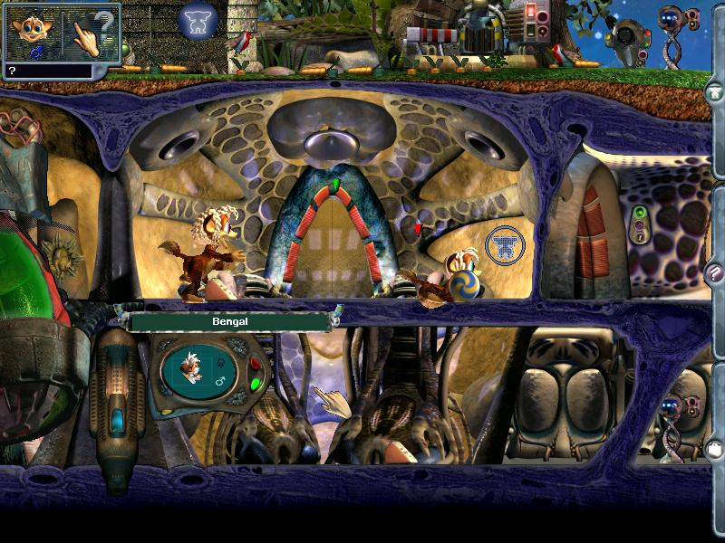

# nornpulse



## About

Inspired by projects such as [OpenRTC2](https://openrct2.org/), the nornpulse project is an attempt to reverse engineer the original c2e engine in rust-lang.

This project is very much a WIP. Currently `nornpulse` only offers a way of circumventing the login system of Docking Station, which can already be achieved by established mods. The next upcoming goal is to replace the rendering engine with SDL2.

## Motivation

If this project succeeds then fans of the original game will be able to run Docking Station on modern cross-platform systems (with better modding support.)

As a secondary, more personal goal, this is an experiment in learning the dark art of backwards engineering and pushing the rust FFI to its breaking point.

## Building (Windows only)

```sh
git clone https://github.com/aneilmac/nornpulse.git
cd nonrpulse/nornpulse
rustup install nightly
rustup target add i686-pc-windows-msvc
cargo build
```

## Execute

1. Grab Docking Station from a legitimate source. [Creatures Exodus, which includes Docking Station, is available on GOG.](https://www.gog.com/game/creatures_exodus)
1. Locate your Docking Station installation.
1. Replace `engine.exe`with the modified `engine.exe` provided in the nornpulse folder.
1. Copy `nornpulse.dll` and `SDL2.dll` from the build output and paste into your Docking Station installation
1. Run!

## Contributing

### Tools to use

* [Ghidra](https://ghidra-sre.org/) is an effective tool in helping understand the static binary.
* [OllyDbg](http://www.ollydbg.de/) is a great assembly debugger.

### Roadmap

This project can be described in distinct phases:

1. From the top down, replace C++ ABI calls with unsafe rust functions. (In progress.)
2. Remove requirement of haivng `engine.exe` and its dependencies. Have the project only run through compiled rust code.
3. Port and rearchitect unsafe rust code to safe rust code.
4. Introduce new features!

### How was engine.exe modified

The rust module `nornpulse.dll` was inserted as a dependency into `engine.exe`. Then the following op-codes were inserted into engine.exe:

```asm
0058744F  |. FF15 48216600  CALL DWORD PTR DS:[<&nornpulse.nornpulse>;  nornpuls.nornpulse_main
00587455  |. 90             NOP
00587456  |. 90             NOP
```

This replaces the entry point of the program after the C++ runtime has loaded.
